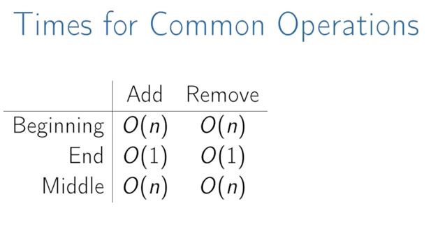

<!--
@Author:    Anas Aboureada
@Date:      Thu Apr 20 2017 18:10:0
@Email:     me@anasaboureada.com
@License:   MIT License
@Copyright: Copyright (c) 2017 Anas Aboureada
-->

# Arrays

## Resources

- [UCBerkley CS61B - Linear and Multi-Dim Arrays (video)](https://youtu.be/Wp8oiO_CZZE?t=15m32s)
- [Basic Arrays (video)](https://www.lynda.com/Developer-Programming-Foundations-tutorials/Basic-arrays/149042/177104-4.html)
- [Multi-dim (video)](https://www.lynda.com/Developer-Programming-Foundations-tutorials/Multidimensional-arrays/149042/177105-4.html)
- [Dynamic Arrays (video)](https://www.coursera.org/learn/data-structures/lecture/EwbnV/dynamic-arrays)
- [Jagged Arrays (video)](https://www.youtube.com/watch?v=1jtrQqYpt7g)
- [Jagged Arrays (video)](https://www.lynda.com/Developer-Programming-Foundations-tutorials/Jagged-arrays/149042/177106-4.html)
- [Resizing arrays (video)](https://www.lynda.com/Developer-Programming-Foundations-tutorials/Resizable-arrays/149042/177108-4.html)

## Todo

- Implement a vector (mutable array with automatic resizing):
- Practice coding using arrays and pointers, and pointer math to jump to an index instead of using indexing.
- new raw data array with allocated memory
  - can allocate int array under the hood, just not use its features
  - start with 16, or if starting number is greater, use power of 2 - 16, 32, 64, 128
- size() - number of items
- capacity() - number of items it can hold
- is_empty()
- at(index) - returns item at given index, blows up if index out of bounds
- push(item)
- insert(index, item) - inserts item at index, shifts that index's value and trailing elements to the right
- prepend(item) - can use insert above at index 0
- pop() - remove from end, return value
- delete(index) - delete item at index, shifting all trailing elements left
- remove(item) - looks for value and removes index holding it (even if in multiple places)
- find(item) - looks for value and returns first index with that value, -1 if not found
- resize(new_capacity) // private function
  - when you reach capacity, resize to double the size
  - when popping an item, if size is 1/4 of capacity, resize to half

## Characteristics

### Time

- O(1) to add/remove at end (amortized for allocations for more space), index, or update
- O(n) to insert/remove elsewhere

### Space

- contiguous in memory, so proximity helps performance
- space needed = (array capacity, which is >= n) \* size of item, but even if 2n, still O(n)
 )
