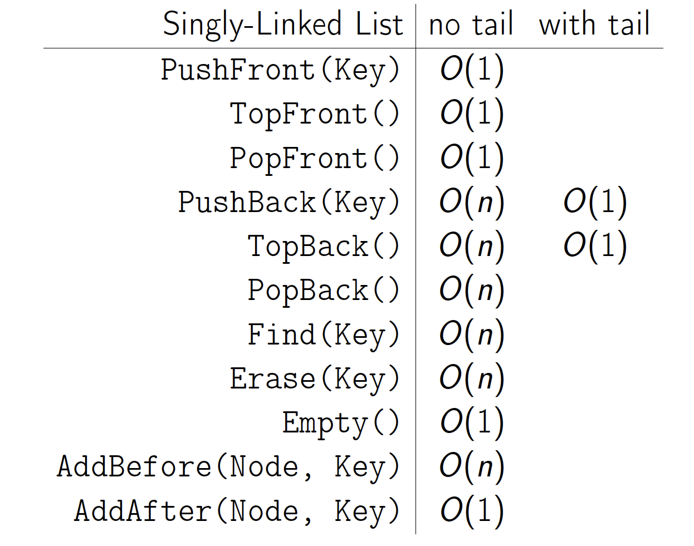
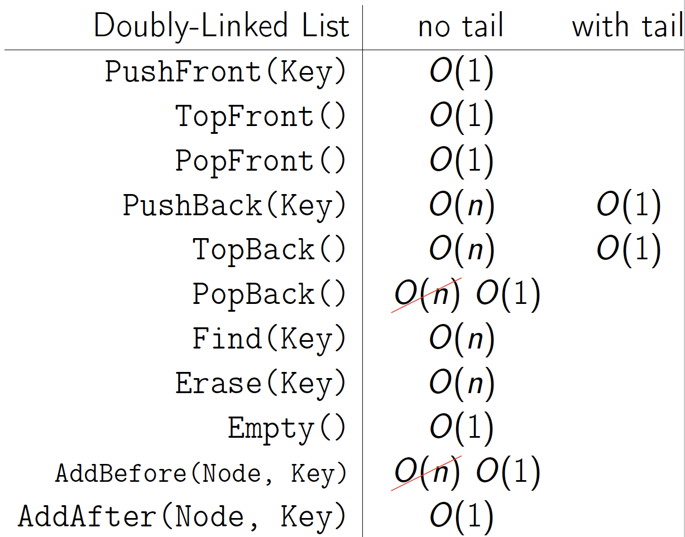

<!--
@Author: Anas Aboureada
@Date: Thu Apr 20 2017 18:11:55
@Email: me@anasaboureada.com
@License: MIT License
@Copyright: Copyright (c) 2017 Anas Aboureada
-->

# Linked Lists

## Resources

- [CS 61B - Linked Lists (video)](https://www.youtube.com/watch?v=sJtJOtXCW_M&list=PL-XXv-cvA_iAlnI-BQr9hjqADPBtujFJd&index=5)
- [C Code (video)](https://www.youtube.com/watch?v=QN6FPiD0Gzo)
  - not the whole video, just portions about Node struct and memory allocation.
- Linked List vs Arrays:
  - [Core Linked Lists Vs Arrays (video)](https://www.coursera.org/learn/data-structures-optimizing-performance/lecture/rjBs9/core-linked-lists-vs-arrays)
  - [In The Real World Linked Lists Vs Arrays (video)](https://www.coursera.org/learn/data-structures-optimizing-performance/lecture/QUaUd/in-the-real-world-lists-vs-arrays)
  - [why you should avoid linked lists (video)](https://www.youtube.com/watch?v=YQs6IC-vgmo)
- Gotcha: you need pointer to pointer knowledge:
 (for when you pass a pointer to a function that may change the address where that pointer points)
 This page is just to get a grasp on ptr to ptr. I don't recommend this list traversal style. Readability and maintainability suffer due to cleverness.
  - [Pointers to Pointers](https://www.eskimo.com/~scs/cclass/int/sx8.html)
- [Doubly-linked List (video)](https://www.coursera.org/learn/data-structures/lecture/jpGKD/doubly-linked-lists)

## TODO

- Singly Linked List

  - implement (I did with tail pointer & without):
  - size() - returns number of data elements in list
  - empty() - bool returns true if empty
  - value_at(index) - returns the value of the nth item (starting at 0 for first)
  - push_front(value) - adds an item to the front of the list
  - pop_front() - remove front item and return its value
  - push_back(value) - adds an item at the end
  - pop_back() - removes end item and returns its value
  - front() - get value of front item
  - back() - get value of end item
  - insert(index, value) - insert value at index, so current item at that index is pointed to by new item at index
  - erase(index) - removes node at given index
  - value_n_from_end(n) - returns the value of the node at nth position from the end of the list
  - reverse() - reverses the list
  - remove_value(value) - removes the first item in the list with this value

### Singly-Linked Lists Time Complexity

### Doubly-Linked Lists Time Complexity

